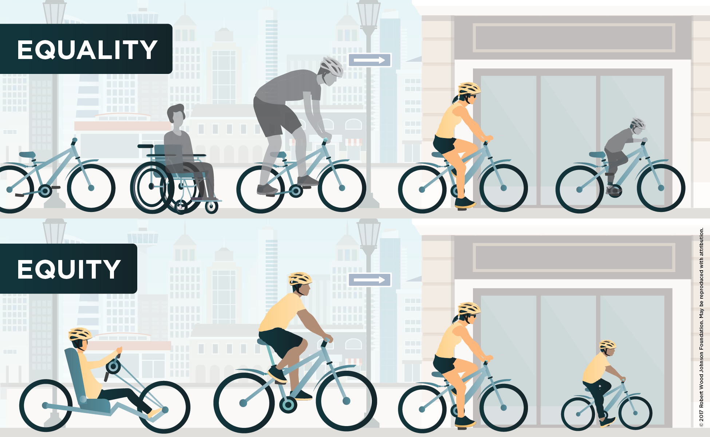
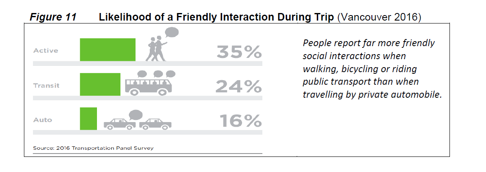
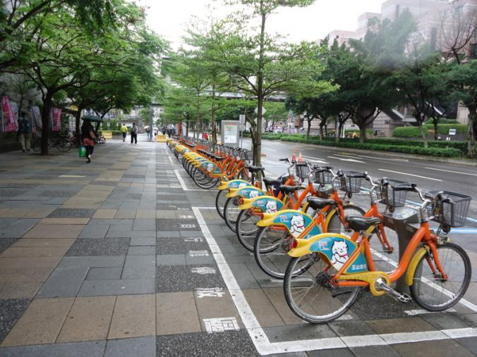
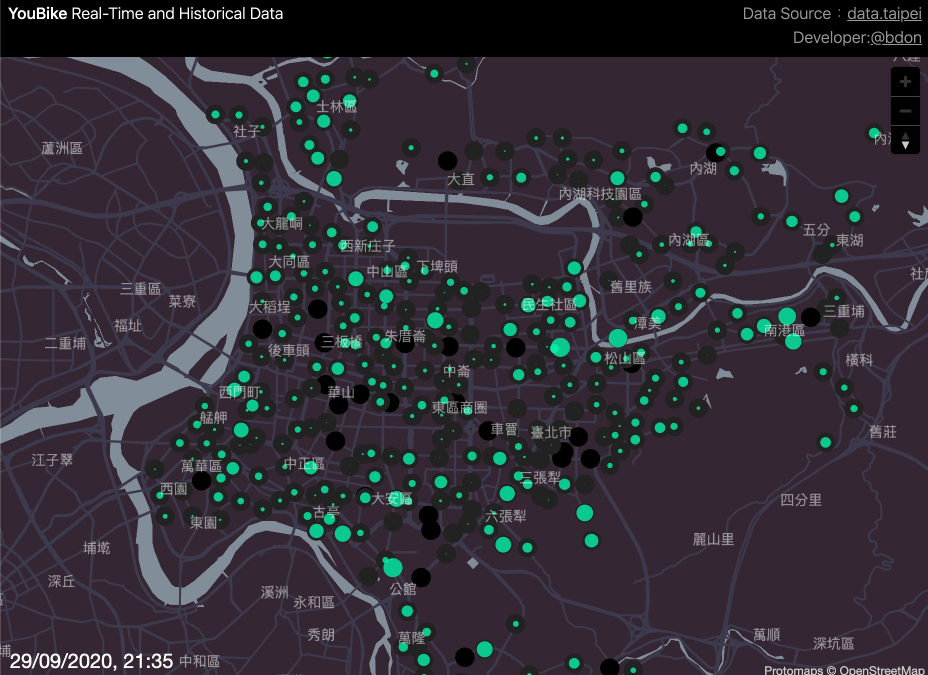
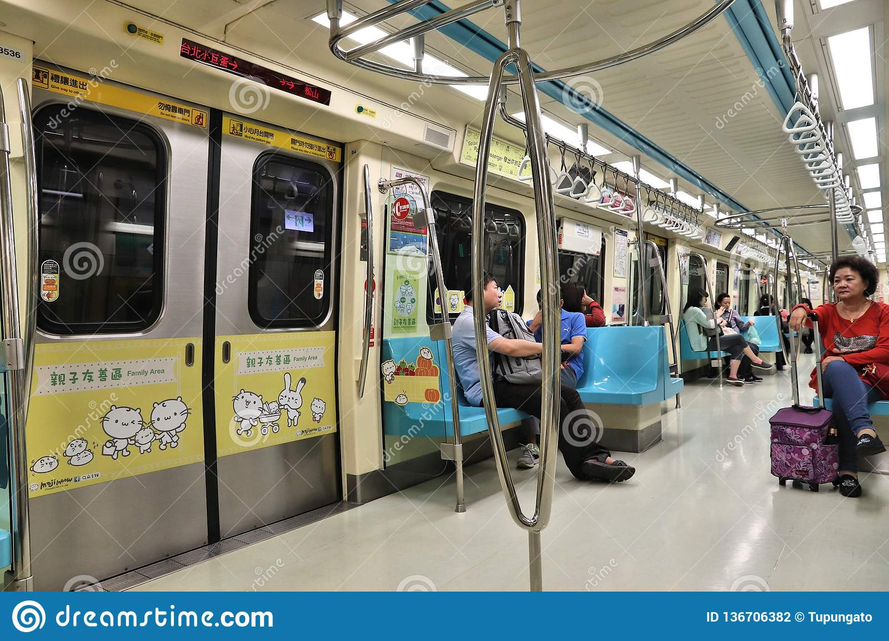
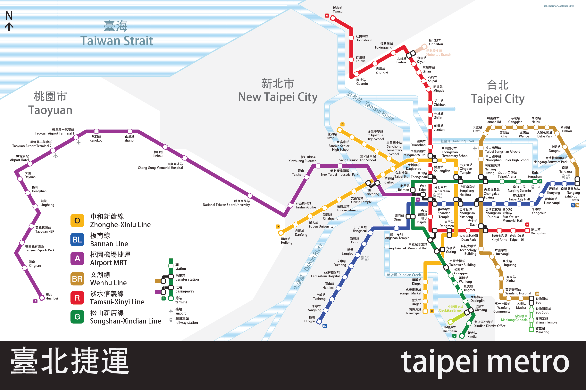

```{r setup, include=FALSE}
knitr::opts_chunk$set(echo = TRUE)
```

# Aim

This project is a theoretical inquiry into specific benefits deriving from a "mobility as a service" (MaaS) model of public transportation systems

## MaaS

MaaS is an emerging concept “that integrates public transport with other mobility services, such as car sharing, ride sourcing, and bicycle sharing” (Smith, 2020) through a unified digital platform that makes sustainable forms of transportation more efficient for users.

[](http://www.bipformaas.it/what-is-maas-lets-learn/){target="_blank"}

(Click image for link to source)

# Theoretical framework

Working from previous discourse on sharing economy models as a form of collaborative reciprocal exchange, I frame this inquiry within the theoretical lens of transportation equity.

## Transportation equity

I refer to transportation equity as the extent to which transportation systems serve all members of the public regardless of social identity or status.

[](https://rsginc.com/project/advancing-transportation-equity/){target="_blank"}

(Click image for link to source)

# Question

This framework leads me to the following question: how might a specific “mobility-as-a-service” model help provide the benefit of community cohesion by fostering an integrated sharing economy platform of collaborative reciprocal exchange?

## Community cohesion

Community cohesion – also referred to as “social capital” and “neighboring” – is defined in the Victoria Transport Policy Institute’s Evaluating Public Transit Benefits and Costs Best Practices Guidelines (Litman, 2021) as “the quality of interactions among residents in a community” based on their level of familiarity and care for one another. 

[]

Image pulled from Victoria Transport Policy Institute's August 2021 report, "Evaluating Public Transit Benefits and Costs"

# Case Study

My case study for this inquiry is Taipei’s bikeshare system, Youbike, and its integration with the city’s Mass Rapid Transit (MRT) system.

## Youbike

[]

[](https://bdon.org/youbike-forecast/){target="_blank"}

Click this gif for animated map of Taipei's bikeshare usage (done by a fellow Youbike enthusiast)

## MRT

[]

[](https://rsginc.com/project/advancing-transportation-equity/){target="_blank"}
(Click image for link to source)

# Argument

Specifically, I argue that the city’s deeply rooted cultural norms guiding residents’ shared usage of the MRT provide a social foundation upon which the YouBike system can further develop the benefit of community cohesion for the public as a whole. 

# Method

I formulate this speculative argument through an analysis of existing research on the following features of YouBike and its integration with the MRT:

## The Public-private partnership funding structures of both systems

## The systems' spatial structures, their integration, and users' resulting activity patterns

## residents' behaviors, intentions, and perceptions as users of the systems

# Implications

With this theoretical analysis, I aim to show that a dedicated empirical study of this question would be useful for transportation planners’ ongoing task of providing more sustainable and equitable forms of transportation. 


